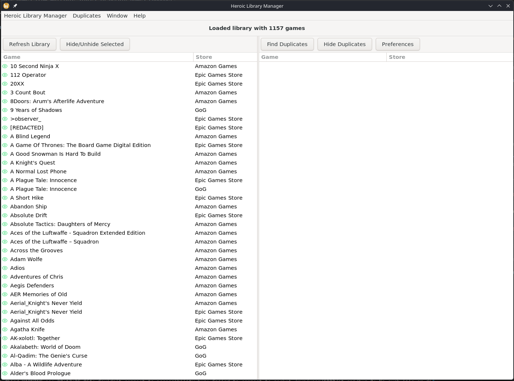
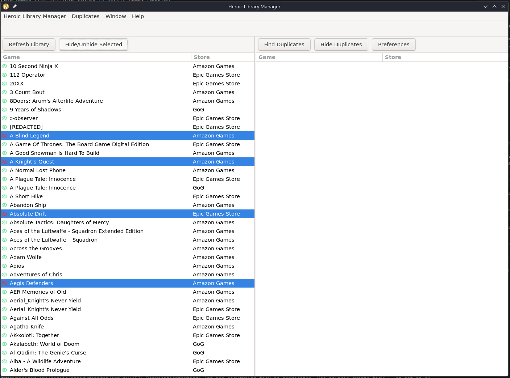
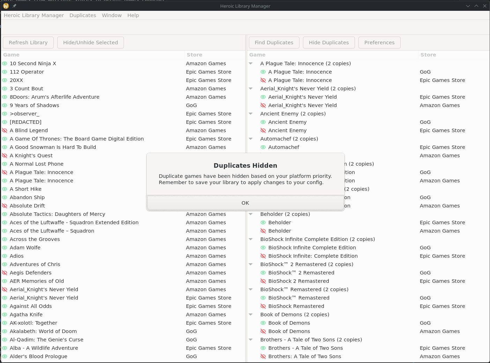

# Heroic Library Manager

Heroic Library Manager helps you clean up duplicate games across stores in Heroic Games Launcher without losing control over what stays visible.

It scans your library data, groups duplicate titles, and lets you hide or unhide entries quickly so your game list stays organized. This application edits the `config.json` file in your Heroic Games Launcher config directory and creates a backup before saving changes.

> [!NOTE]
> Although this project is technically cross-platform, it has been built solely with Linux in mind.

**Why does this exist?**
I have a library of more than 1200 games spread across GOG, Epic, and Amazon Games, and over time it has accumulated a lot of duplicates. Heroic Game Launcher did not give me an easy way to manage those duplicates or quickly hide and unhide games in bulk.

I originally handled this with bash scripts, but that approach was not practical for most people. This project is my attempt to turn that workflow into a simple GUI tool that is easier to use and more accessible.

## Highlights

- Load and browse your Heroic library in a simple two-pane view.
- Find duplicate game groups across stores like Epic, GOG, and Amazon.
- Hide duplicates in bulk based on your platform priority settings.
- Review and toggle hidden state for individual games.
- Save hidden-game changes back to Heroic config with backups.

## Project Status

- [x] Game hiding and unhiding support
- [x] Basic deduplication functionality
- [x] Backup configuration before saving
- [ ] UI for backup/restore functionality
- [ ] Logo for application
- [ ] Beta release

## Getting Started

> [!WARNING]
> This app is still in alpha stage. Although backups are created before changes are written to your library config, additional backups are highly recommended.

### Platform Support

| Platform | Supported | Notes |
| --- | --- | --- |
| Linux | Yes | Primary target (tested on Bazzite/Fedora-based systems & Debian container). |
| Windows | No | Not supported yet. |
| macOS | No | Not supported yet. |

Build and install from source with Briefcase.

**Requirements:**

- Python 3.12
- Flatpak
- flatpak-builder
- Git

### TLDR Setup

Assuming you're using a bash shell, run each command one after the other:

```bash
git clone https://github.com/preppie22/heroiclibrarymanager.git && cd heroiclibrarymanager

python -m venv .venv

source .venv/bin/activate

python -m pip install briefcase

briefcase dev
```

The only thing that will change with a different shell like fish or zsh is the venv activation.

### Initial Setup

Make sure that you have run Heroic Games Launcher at least once with your game library populated.

1. Clone the repository and enter it.

    ```bash
    git clone https://github.com/preppie22/heroiclibrarymanager.git && cd heroiclibrarymanager
    ```

2. Create and activate a [Python environment](https://docs.python.org/3/library/venv.html). Optionally, you can use pyenv.
3. Install Briefcase:

    ```bash
    python -m pip install briefcase
    ```

### Linux (Flatpak)

1. Generate/update Flatpak project files:

    ```bash
    briefcase create linux flatpak
    ```

2. Build and install locally for your user:

    ```bash
    briefcase build linux flatpak
    ```

3. Run the app:

    ```bash
    flatpak run io.github.preppie22.heroiclibrarymanager
    ```

- (Optional) Create an installable flatpak in the `dist` directory:

    ```bash
    briefcase package linux flatpak
    ```

If Heroic is installed as a Flatpak, make sure this app has permission to read Heroic's config path.

### Linux (Dev)

1. Run the application in a dev environment (no sandbox!)

    ```bash
    briefcase dev
    ```

## Usage

First and foremost, make sure that Heroic Game Launcher is installed and you have your full library imported and visible in it. Then open this application.

**Basic:**

- The left panel shows a list of all games that were found in your Heroic Library.
- Double-click on a game to hide it (red eye).
- Double-click on a hidden game to unhide it (green eye).
- Select multiple games using Ctrl/Cmd or Shift and click "Hide/Unhide Selected" to operate on multiple games at the same time.

**Deduplication:**

- Click on the "Find Duplicates" button to find all duplicates in your library.
- Click on "Preferences" to set a priority order for stores. The priority order decides which store games will be hidden when duplicates are found.
- Click on "Hide Duplicates" to hide duplicate games and keep only one entry unhidden.

> [!NOTE]
> Library changes are not written to file immediately. Press 'Ctrl + S' to save your changes or click on "Save Library" in the menu.

**Library Backups:**

Heroic Library Manager creates backups in the Heroic Games Launcher config directory in a folder called `backups_hlm`. Typically, the path will be:
`~/.var/app/com.heroicgameslauncher.hgl/config/heroic/backups_hlm/`

The backup is named using the following format: `config_YYYYmmdd_HHMMss.json`. So, if the library is saved at 3:41:22pm on April 4, 2026, the corresponding backup file will be `config_20260412_154122.json`. To restore this file, simply overwrite `~/.var/app/com.heroicgameslauncher.hgl/config/heroic/config.json` with this file.

This backup/restore functionality will be implemented into the app in the future.

## Screenshots





## AI Disclaimer

AI was used only as a development aid for debugging, refactoring, and editing parts of the codebase. The application’s core logic, design, and overall direction were developed by the author, and all AI-assisted changes were reviewed and validated before being kept.

## Built With

This cross-platform app was generated by [Briefcase](https://briefcase.readthedocs.io/), part of [The BeeWare Project](https://beeware.org/).

If you want to see more tools like Briefcase, please consider [becoming a financial member of BeeWare](https://beeware.org/contributing/membership).
